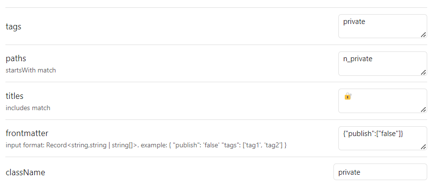

# obsidian-dynamic-classname

Assign user-defined class names to views according to tags, front matter, title, and path conditions

> [!NOTE]
> This plugin is almost exclusively for me.
> However, if you have any requests, feel free to make an issue.


## Example

### Settings



### Css

```css
.view-content {
	&::after {
		padding: 2px 0.5em;
		border-radius: 4px;
		font-weight: bold;

		position: absolute;
		top: 20px;
		right: 40px;
	}

	&.private {
        border: 2px solid red;
		&::after {
			content: "🔐 Private";
			color: red;
			background-color: rgb(255, 223, 223);
			border: 1px solid red;
		}
	}
	&:not(.private) {
		border: 2px solid blue;
		&::after {
			content: "📣 Public";
			color: blue;
			background-color: rgb(223, 223, 255);
			border: 1px solid blue;
		}
	}
}
```

### View


